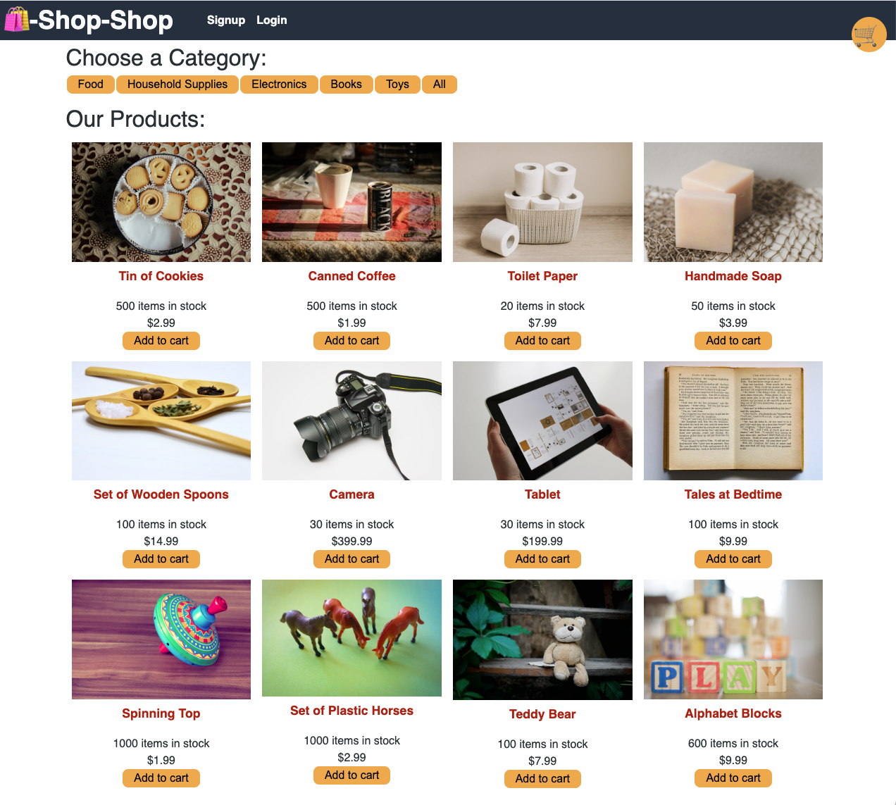

# Redux Store

## Description 

For this project, I took a functioning e-commerce app and refactored it from [Context](https://react.dev/learn/passing-data-deeply-with-context) to [Redux](https://redux.js.org/). Context is a part of React, and it is used for managing local component state and sharing data through the component tree without having to pass props down manually at every level. Redux is used for managing the global state, providing a centralized store for the entire application.

This work involved a careful examination of various components to swap out the Context functionality and replace it with Redux. This also meant ensuring that only the applicable portions of the state were selected by different components to prevent rerendering the entire state every time anything was changed. I had to make sure everything still worked, including the reducer tests and the payment processing with [Stripe](https://stripe.com/).

This project was successfully deployed on [render](https://render.com/) with a [MongoDB Cloud](https://www.mongodb.com/) database. It can be accessed [here](https://redux-store-b91t.onrender.com/).


## Installation

To install the application locally, copy the files and folders to the desired location. To install dependencies, enter the command

```
npm install
```

from the root directory.

To seed the database with example data, enter the command

```
npm run seed
```

again from the root directory.


## Usage 

The application can be run from its deployed location [here](https://redux-store-b91t.onrender.com/).

To run it locally in a development environment, enter the command
```
npm run develop
```
from the root directory. Then open the following address in your web browser:
```
http://localhost:3000/
```

On page load, the user is presented with the home page. A nav bar has **Signup** and **Login** links, as well as a shopping cart icon link to view the current contents of the cart. Authenticated users have an **Order History** link as well.

Product category buttons are displayed and allow filtering of the various products. Individual products can be selected to view details, and in both the home page view and the detail view the items can be added to the cart. They can be added multiple times to increase the quantity, or the desired quantity for each added item can be input directly in the shopping cart.

Checkout is processed through Stripe, and test purchases can be made with Stripe's [test payment info](https://stripe.com/docs/testing).




## Credits

Most of the code was already written, as can be seen in the repo commit history. I had to add 
[Redux](https://www.npmjs.com/package/redux) and [react-redux](https://www.npmjs.com/package/react-redux) and modify the code appropriately. I also had to deploy using render and then link a manually populated MongoDB database.


## License

Please refer to the LICENSE in the repo.


---
